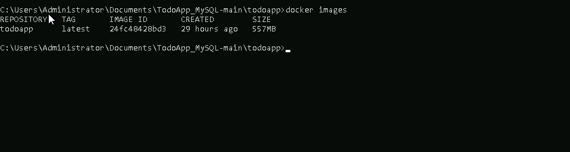
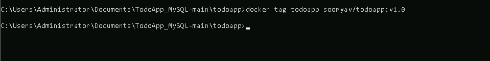
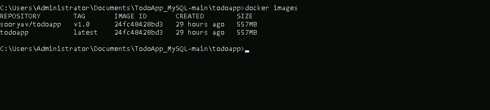
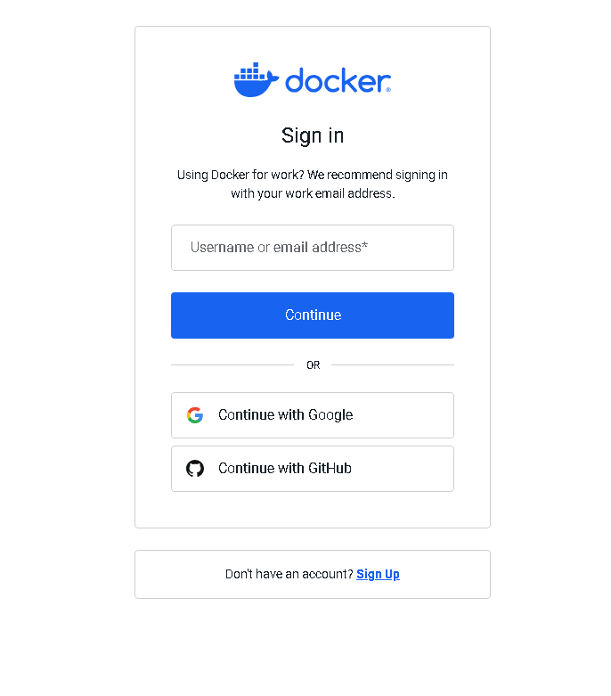
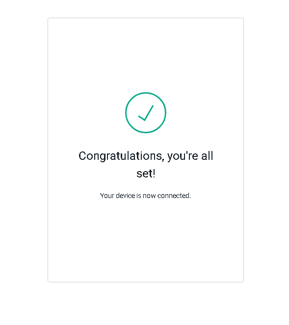
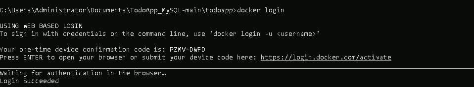
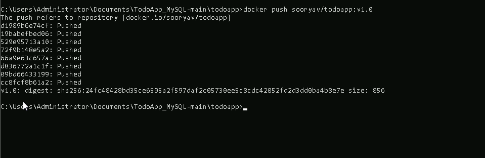
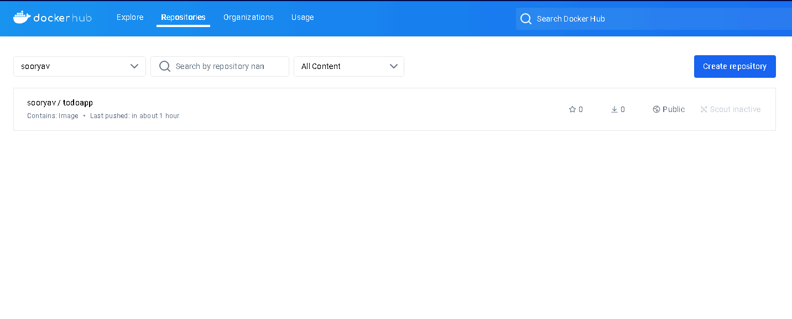

# **Use Docker commands to build, tag, and push Docker images to a registry**

## **Table of Contents**

---

* [**Description**](#description)
* [**Problem Statement**](#problem-statement)
* [**Prerequisites**](#prerequisites)
  - [**Software Requirement**](#software-requirement)
  - [**Hardware Requirement**](#hardware-requirement)
* [**Implementation Steps**](#implementation-steps)
  - [**Step-1: Build the Docker Image**](#step-1-build-the-docker-image)
  - [**Step-2: Tag the Docker Image**](#step-2-tag-the-docker-image)
  - [**Step-3: Push the Docker Image to a Registry**](#step-3-push-the-docker-image-to-a-registry)
* [**References**](#references)

## **Description**

---

This guide explains how to build, tag, and push Docker images for your **TodoApp** using Docker commands. After creating a Dockerfile for the web application, you'll need to build the image, assign a tag, and push it to a remote registry (such as Docker Hub or a private registry).

## **Problem Statement**
---
To deploy your **TodoApp** in different environments or share it with others, you must publish the Docker image to a registry. This requires:
- Building a Docker image from the application code.
- Tagging the image with a unique identifier (such as a version number).
- Pushing the image to a Docker registry for distribution.

## **Prerequisites**
---
Completion of all previous lab guides (up to Lab Guide-01) is required before proceeding with Lab Guide-02.

### **Software Requirement**
- **Docker Desktop**: Installed on your Windows machine.
- **Docker Hub Account** (or any other Docker-compatible registry).
- **TodoAPP_MYSQl**: To download the source folder [**click here**](https://github.com/SwayaanTechnologies/TodoApp_MySQL/archive/refs/heads/main.zip)

### **Hardware Requirement**
- Minimum of 4 GB RAM.
- At least 2 cores in the processor.

## **Implementation Steps**
---
### **Step-1: Build the Docker Image**
1. **Create a Dockerfile** for your TodoApp (if not done already). Here is an example Dockerfile for a simple Java-based web application:

```Dockerfile
FROM openjdk:11.0.15-jre
ADD target/*.jar app.jar
ENTRYPOINT ["java","-jar","app.jar"]
```

2. **Build the Docker image**:

```bash
docker build -t todoapp .
```

In this example:
- **`todoapp:latest`** is the tag you are assigning to the image. The `latest` tag indicates that this is the most current version.
- The `.` specifies that Docker should look for the Dockerfile in the current directory.


3. Verify that the image was built successfully:

```bash
docker images
```

This command will list all available Docker images. You should see `todoapp` in the list.



### **Step-2: Tag the Docker Image**

Next, assign a tag to the image so that it can be pushed to a registry. Tags generally include the registry URL, the repository name, and a version number.

```bash
docker tag todoapp:latest <your-dockerhub-username>/todoapp:v1.0
```

In this example:
- **`<your-dockerhub-username>`** is your Docker Hub username.
- **`todoapp:v1.0`** assigns a version (`v1.0`) to the image.

Now, when you list images using `docker images`, you should see the newly tagged image.





### **Step-3: Push the Docker Image to a Registry**

To make the image accessible to others, push it to a Docker registry. For this example, we will use Docker Hub, but you can push to any compatible registry.

1. **Login to Docker Hub**:

```bash
docker login
```


- Copy the device confirmation code and submit the device code here: [https://login.docker.com/activate](https://login.docker.com/activate)


- You’ll be prompted to enter your Docker Hub username and password.



- Once the device is connected, you should should an output like this:





2. **Push the tagged image** to Docker Hub:

```bash
docker push <your-dockerhub-username>/todoapp:v1.0
```

Docker will upload the image to your Docker Hub repository.



3. **Verify the image**:

Once the push is complete, visit [Docker Hub](https://hub.docker.com/) and verify that your image is available in your repository.



## **References**

- Docker Hub Documentation: [https://docs.docker.com/docker-hub/](https://docs.docker.com/docker-hub/)
- Docker Build and Push: [https://docs.docker.com/engine/reference/commandline/push/](https://docs.docker.com/engine/reference/commandline/push/)
- Tagging Docker Images: [https://docs.docker.com/engine/reference/commandline/tag/](https://docs.docker.com/engine/reference/commandline/tag/)
