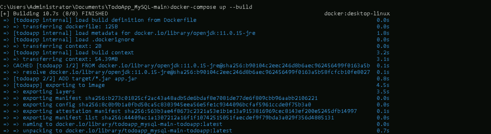
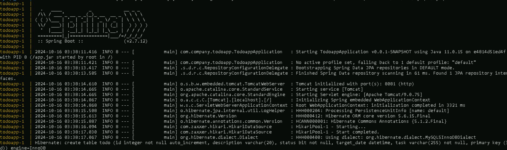

# **Use YAML to define configurations for a Docker Compose project**

## **Table of Contents**
---
* [**Description**](#description)  
* [**Problem Statement**](#problem-statement)  
* [**Prerequisites**](#prerequisites)
  - [**Software Requirement**](#software-requirement)  
  - [**Hardware Requirement**](#hardware-requirement)  
* [**Implementation Steps**](#implementation-steps) 
  - [**Step-1 :: Create Standard Folder Structure**](#step-1--create-standard-folder-structure)  
  - [**Step-2 :: Create docker-compose.yml**](#step-2--create-docker-composeyml) 
   - [**Step-3 :: Run the Program**](#step-3--run-the-program)
   - [**Step-4 :: Manage the Containers**](#step-4--manage-the-containers)
* [**References**](#references)

## **Description**
---
This guide demonstrates how to use Docker Compose to define a multi-container application. We’ll set up two containers: one for a Java-based TodoApp and another for a MySQL database. Using Docker Compose simplifies managing multiple containers and their communication.


## **Problem Statement**
---
You need to run a Java-based TodoApp that requires a MySQL database. Instead of manually configuring and linking containers, you want to automate this process using a **docker-compose.yml** file.

## **Prerequisites**
---
Completion of all previous lab guides (up to Lab Guide-03) is required before proceeding with Lab Guide-04.

### **Software Required**

- **Docker Desktop**: Ensure Docker and Docker Compose are installed on your Windows machine.
- **Java SDK**: If you're working with Java.
- **Maven/Gradle**: For building your Java app.
- **MySQL Database**: To store todo application data.
- **TodoAPP_MYSQl**: To download the source folder [**click here**](https://github.com/SwayaanTechnologies/TodoApp_MySQL/archive/refs/heads/main.zip)
## **Hardware Requirement**

- Minimum of 4 GB RAM
- At least 2 cores in the processor
- 5 GB of free storage space for Docker images and containers

## **Implementation Steps**
---
### **Step-1 :: Create Standard Folder Structure**

1. Create a project folder:

    ```bash
    todoapp-docker
    ├── docker-compose.yml
    ├── todoapp/
    │   ├── Dockerfile
    │   ├── src/
    │   └── target/
    └── db/
    ```

2. **Dockerfile** for your Java-based TodoApp:

    Inside the `app/` directory, create a `Dockerfile` to build the Java TodoApp.

    ```Dockerfile
    FROM openjdk:11.0.15-jre
    ADD target/*.jar app.jar
    ENTRYPOINT ["java","-jar","app.jar"]
    ```

### **Step-2 :: Create docker-compose.yml**

In the root directory of your project, create a **docker-compose.yml** file:

```yaml
    
    services:
      # MySQL Database Service
      db:
        image: mysql
        container_name: mysql_db
        environment:
          MYSQL_ROOT_PASSWORD: P@ssw0rd
          MYSQL_DATABASE: tododb
          MYSQL_PASSWORD: P@ssw0rd
        ports:
          - "3306:3306"
        networks:
          - todoapp_network
        volumes:
          - db_data:/var/lib/mysql

      # Java TodoApp Service
      todoapp:
        build:
          context: ./todoapp
        container_name: todoapp_container
        ports:
          - "8081:8081"
        depends_on:
          - db
        environment:
          SPRING_DATASOURCE_URL: jdbc:mysql://db:3306/tododb
          SPRING_DATASOURCE_USERNAME: root
          SPRING_DATASOURCE_PASSWORD: P@ssw0rd
        networks:
          - todoapp_network
        entrypoint: sh -c "sleep 30 && java -jar /app.jar"
    networks:
      todoapp_network:
        driver: bridge

    volumes:
      db_data:
```

* **Services Section**: 
This section defines the different containers (services) that will be run as part of the Docker Compose setup.

* **image: mysql**: This specifies the Docker image to use. In this case, it uses the official MySQL image from Docker Hub.
* **container_name: mysql_db**: This gives the container a specific name (**mysql_db**).
* **depends_on**: Ensures that the **todoapp** service starts after the **db** service (MySQL) is up and running. However, this does not wait for the database to be fully initialized.
* **environment**: Defines the environment variables to configure MySQL:
  - **MYSQL_ROOT_PASSWORD**: Sets the root user password (**P@ssw0rd**).
  - **MYSQL_DATABASE**: Creates a database named **tododb**.
  - **MYSQL_PASSWORD**: Sets the password for the default MySQL user (root).
  - **SPRING_DATASOURCE_URL**: Defines the JDBC connection URL to the MySQL database (**db** is the hostname for the database within the Docker network).
  - **SPRING_DATASOURCE_USERNAME**: Sets the username to connect to the MySQL database (**root**).
  - **SPRING_DATASOURCE_PASSWORD**: Defines the password to connect to the MySQL database.
* **ports**: Exposes port **3306** (MySQL’s default port) on the host system, allowing external connections to the MySQL database.
  - **"3306:3306"**: The format is **host_port:container_port**.
* **entrypoint: sh -c "sleep 30 && java -jar /app.jar"**: This introduces a delay of 30 seconds before starting the application, allowing MySQL to be ready.
* **networks**: Adds this service to the custom network **todoapp_network** so that the other services can communicate with it.
* **volumes**: Uses a Docker volume (**db_data**) to persist the database data so that it won't be lost when the container is restarted. The database files are stored in **/var/lib/mysql** inside the container.

### **Step-1 :: Run the Program**

To start the multi-container application:

1. Navigate to the project folder containing the **docker-compose.yml** file.

    ```bash
    cd Docker
    ```

2. Run Docker Compose to build and start the containers:

    ```bash
    docker-compose up --build
    ```

This command:

* **Builds** the Java TodoApp container.
* **Pulls** the MySQL image if it's not available locally.
* **Creates** and **starts** the containers for both services.
* **Establishes** a network (todoapp_network) allowing them to communicate.

3. Check the logs to ensure everything is running properly. Once both containers start, you should see output from both services.
    

    

4. Once the deployment is successful:
    * **Access** the Java TodoApp on your browser at **http://localhost:8081/swagger-ui/index.html**
    * The MySQL database will be running on port **3306**, and the TodoApp will communicate with it.


### **Step-2 :: Manage the Containers**

1. **Check the status of the containers**:

    ```bash
    docker-compose ps
    ```

    

    This will display the list of running containers along with their status and ports.

2. **Stop the running containers**:

    To stop and remove all the containers, networks, and volumes created by `docker-compose`:

    ```bash
    docker-compose down
    ```

    

3. **Run the containers in detached mode**:

    If you want the containers to run in the background (without displaying logs in the terminal), you can run the following command:

    ```bash
    docker-compose up -d
    ```
    

    To stop the detached containers:

    ```bash
    docker-compose down
    ```
    .png)

4. **View container logs** (for troubleshooting):

    ```bash
    docker-compose logs
    ```

    

## **References**
---

- Docker documentation: [https://docs.docker.com/](https://docs.docker.com/)
- Docker Compose official guide: [https://docs.docker.com/compose/](https://docs.docker.com/compose/)
- MySQL Docker Hub page: [https://hub.docker.com/_/mysql](https://hub.docker.com/_/mysql)
- Java and Spring Boot examples: [Spring Boot with Docker](https://spring.io/guides/gs/spring-boot-docker/)
